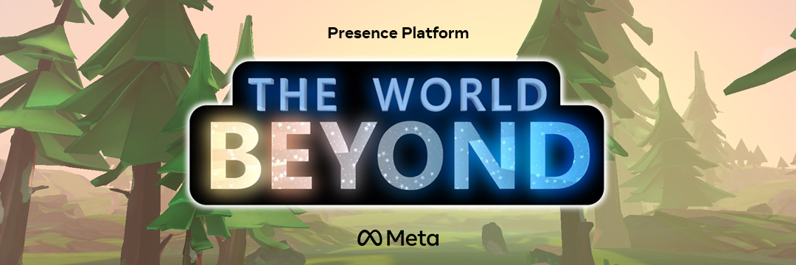
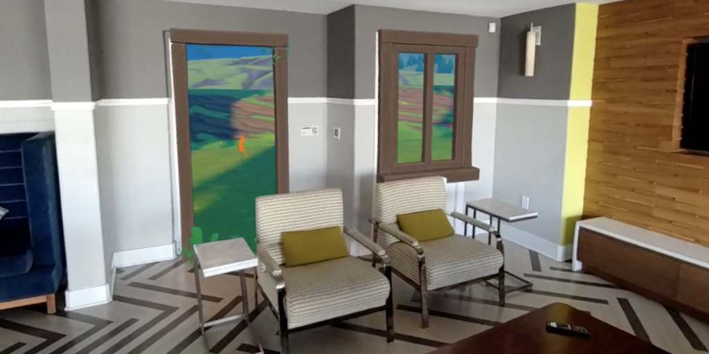
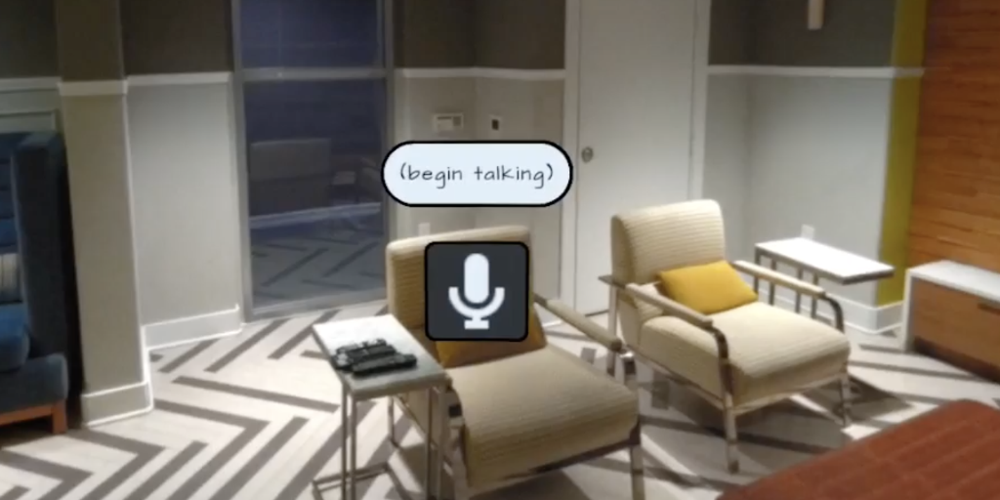

# The World Beyond
In this sample project, you'll learn how to take advantage of our Presence Platform features. This source code will compile into the same experience you play when downloading it from App Lab [here.](https://www.meta.com/experiences/the-world-beyond/4873390506111025/)

# Licenses
The majority of TheWorldBeyond is licensed under [MIT LICENSE](./LICENSE), however files from [Text Mesh Pro](http://www.unity3d.com/legal/licenses/Unity_Companion_License) are licensed under their respective licensing terms.

## Requirements
* Unity 2020.3.18f1
* Mac or Windows

## Getting Started
* *PCs:* You can run the Unity Editor using Oculus Link if you are on a PC. Keep in mind that the Passthrough image only appears in the headset. For Scene API, room data must exist before connecting device; disconnect Oculus Link, run Room Setup on your Quest, then reconnect Oculus Link.
* *Macs:* If you are on a Mac, you must build an apk and deploy it to your device.

# Health & Safety Guidelines
While building mixed reality experiences, we highly recommend evaluating your content to offer your users a comfortable and safe experience. Please refer to the [Mixed Reality H&S Guidelines](https://developer.oculus.com/resources/mr-health-safety-guideline/) before designing and developing your app using this sample project or any of our Presence Platform Features.

# Scene Structure & Prefabs
The main scene in The World Beyond is "TheWorldBeyond.unity," which contains the core experience. This scene should be the only one in the Build settings. Most of the content in this scene is pre-existing, meaning the system does not spawn it at runtime. Some exceptions are the virtual room (visible through flashlight), Passthrough walls, and any ground grass in your room.  Some other notes about the scene you should be aware of include:
* *NavMesh:*  This is what Oppy walks on, and it lives under the Environment/EnvRoot object. *NavMesh* is part of the Unity Editor. The scene adds obstacles dynamically (e.g., your room walls, furniture, and trees/rocks in the foreground).
* *WorldBeyondManager:* Holds the *WorldBeyondManager* component, which manages the whole demo. Consider *WorldBeyondManager* as the `main()` function.
* *MultiToy:*  You can attach *MultiToy* to your hand/controller. Only one MultiToy will ever exist, and you can attach it to either hand.
* *Oppy:* Everything related to Oppy is in *Oppy*.
* *Environment:* Everything in the virtual world, except for the UFO, is included in *Environment*.

# Scene API
Using your room surfaces and furniture cubes is crucial for creating the environment.

## Creating the Environment
A traditional pre-fabricated game level doesn't work in mixed reality because the player's space is unknown. Instead, you need to create the world dynamically by following some rules:
* The walkable virtual space should be flat ground to match the player's real space.
* The largest playable space that Guardian can encompass is 15x15m. Everything outside of this space can be static and hand-crafted, but everything within it should be dynamic since every home's play area is different. You should create any objects in the playable space directly or indirectly from the scene or cull them from the scene.

## Using the Scene Directly
*OVRSceneManager* is used to spawn walls and cubes, which you use directly in the *WorldBeyondManager*. The system creates a polygon mesh for the floor and ceiling by referencing these anchors. Particles line the wall edges and get revealed when a wall is "opened." Additionally, a *NavMeshObstacle* component is on the wall and furniture prefabs so that Oppy can navigate around them. Please see [`VirtualRoom.Initialize()`](https://github.com/oculus-samples/Unity-TheWorldBeyond/blob/main/Assets/Scripts/VirtualRoom.cs#L212) for more information.

## Using the Scene Indirectly
Grass shrubs spawn in a grid on the play area, except within the bounding box of the room. A density map defines the probability of grass appearing in a grid cell as long as it appears outside the room. See [`WorldBeyondEnvironment.SpawnObjectsWithMap()`](https://github.com/oculus-samples/Unity-TheWorldBeyond/blob/main/Assets/Scripts/WorldBeyondEnvironment.cs#L61)for more information. Other objects, such as trees and rocks, are pre-littered around the space and use the [`VirtualRoom.IsPositionInRoom()`](https://github.com/oculus-samples/Unity-TheWorldBeyond/blob/main/Assets/Scripts/VirtualRoom.cs#L987) function to get deactivated when the game starts. Grass shrubs are also placed around the base of furniture and walls. The system reveals these shrubs when you open any wall. [`VirtualRoom.CreateFurnitureDebris()`](https://github.com/oculus-samples/Unity-TheWorldBeyond/blob/main/Assets/Scripts/VirtualRoom.cs#L818) handles this functionality.

## Spawning Dynamic Objects
The coordinates in Unity are completely unrelated to a real space. Finding an unoccupied location in your room can be done using the Scene API. In The World Beyond, we do a line-of-sight raycast from the camera, for example, in [`WorldBeyondManager.GetRandomToyPosition()`](https://github.com/oculus-samples/Unity-TheWorldBeyond/blob/main/Assets/Scripts/WorldBeyondManager.cs#L957). Other suggestions for using the Scene API:
* Get the wall intersections of the room, inset by a small amount, to place an object in the corner. You can copy some of this code from [`VirtualRoom.GetClockwiseFloorOutline()`](https://github.com/oculus-samples/Unity-TheWorldBeyond/blob/main/Assets/Scripts/VirtualRoom.cs#L534) and [`SceneMesher.GetInsetDirection()`](https://github.com/oculus-samples/Unity-TheWorldBeyond/blob/main/Assets/Scripts/SceneMesher.cs#L428). Additionally, after calculating a position, you might need to check the furniture data to ensure there isn't something in the way.
* Get the bounding box center of the room, and hang a fan or light from the ceiling.
* Only do raycasts behind the player. Using raycasts is an excellent method for spawning zombies or other hidden elements that only get revealed when the player looks in that direction.

# Passthrough
We have summarized masking Passthrough using the Insight SDK [here.](https://developer.oculus.com/documentation/unity/unity-customize-passthrough/#compositing-and-masking) The approach we use in The World Beyond is to set Passthrough as an underlay and reveal it by modifying the application's alpha level. This can be done in two ways:

## Depth Test
The Depth Test solution takes advantage of the standard rendering flow. So, for example, you could:
* Apply a DepthOnly material to any object you'd like to be Passthrough, e.g., the hand mesh. This "invisible" DepthOnly material exists in `Assets/MultiToy/Materials`. Please note that the render queue is under 2,000.
* Any standard opaque/transparent objects render in a queue at or above 2,000, which means they fail the depth test behind the DepthOnly object and don't render, leaving the Passthrough background.

There are some caveats with this approach:
* It only works on the entire mesh.
* It doesn't use textures and can't soft fade.
* It doesn't truly erase prior pixel alpha; it just occludes objects that are physically behind the object. For example, if your camera has a clear color with alpha opacity, this technique won't "punch" through that value to reveal Passthrough.

## Shader Masking
The Shader Masking technique provides much more control at the cost of complexity. There are shaders in the project that you can use directly (any shaders with "Passthrough" in the name), but for special cases, you'll need to make custom shaders. Copying and modifying the existing ones should help. When writing masking shaders, the important parts to consider are:

* *Zwrite/ZTest:* As mentioned above, *Zwrite/ZTest* defines if the object's mesh should write its depth to the Z-buffer and read from the Z-buffer for depth testing.
* *Vertex Shader:* This is where the 3D math happens, converting all the object's mesh vertex positions into a position on the screen.
* *Fragment Shader:* For simplicity, you can also think of this as a pixel shader or how the screen-space pixel on the object is colored. For example, this shader is where you sample a texture map.
* *Output:* This is the last line in the *Fragment Shader*. *Output* returns some variation of float4(R,G,B,A).
* *Blending:* This defines how the system will blend the shader's Output pixel with the existing pixel on the screen.

# Voice
In The World Beyond, the system unlocks Voice control after opening a wall to the virtual world; Oppy then listens to you when you gaze at her. For detailed instructions on using the Voice SDK, follow the [developer documentation](https://developer.oculus.com/documentation/unity/voice-sdk-overview/). Here are examples of how we use the Voice SDK in The World Beyond:

* *Reaction:*  To play an animation on Oppy (hi, jump) or perform a behavior (come). See [`WitConnector.WitResponseReceiver()`](https://github.com/oculus-samples/Unity-TheWorldBeyond/blob/main/Assets/Scripts/WitConnector.cs#L171) for more information.
* *Transcription:* You can see the results of your command in Oppy's speech bubble. See [`WitConnector.LiveTranscriptionHandler()`](https://github.com/oculus-samples/Unity-TheWorldBeyond/blob/main/Assets/Scripts/WitConnector.cs#L171) for more information.

# Interaction
You can easily include hands-support using our Interaction components with little understanding of how the code works. You can learn more about the *Interaction SDK* from our documentation [here](https://developer.oculus.com/documentation/unity/unity-isdk-interaction-sdk-overview/). In The World Beyond, we use the *Interaction SDK* to let users grab and release the energy orbs.
* The *OVRInteraction* object exists under the *OVRCameraRig* prefab. There are important fields on the *WorldBeyondManager* game object that point to children of this interaction rig, so be careful when replacing it.
* The ball prefab, which is the only element in The World Beyond designed for usage with *ISDK*, is located in `Assets/VFX/EnergyBall/BouncingBall.prefab`. Please note that the *Interaction SDK* manages many of the components on the object.
* Other hand behaviors, such as wall opening or toy switching, are custom and exist outside of *ISDK*. This functionality shows that you can mix and match how you want to implement hands in your project.

# Audio Spatializer
Audio in The World Beyond uses the *Oculus AudioManager* and *Oculus Spatializer*. Get a deep understanding of it from our documentation [here](https://developer.oculus.com/documentation/unity/audio-spatializer-features/). The mixer for the project exists at `Assets/Audio/SanctuaryAudioMixer.mixer`.
* You can use simple raycasting for occlusion. For instance, if a sound is in the virtual world behind your Passthrough wall. You can see how we do this in [`SoundEntry_Manager.HandleObstructed()`](https://github.com/oculus-samples/Unity-TheWorldBeyond/blob/main/Assets/Scripts/SoundEntry_Manager.cs#L94).
* The system mutes environment audio when all the Passthrough walls are closed. The audio increases as you open each wall. Anytime a wall status changes, the system adjusts the audio accordingly in [`AudioManager.SetRoomOpenness()`](https://github.com/oculus-samples/Unity-TheWorldBeyond/blob/main/Assets/Scripts/AudioManager.cs#L444).

# Sample Scenes
The main scene to build is "TheWorldBeyond.unity." To simplify the development experience, there are much smaller scenes in the project to use as starters. These are located in the [SampleScenes](https://github.com/oculus-samples/Unity-TheWorldBeyond/blob/main/Assets/SampleScenes) folder:

## Passthrough Pet

If you'd like to explore augmented pet behavior, you can start here. It provides the Scene elements as occluding colliders, so Oppy convincingly renders behind and avoids furniture. A NavMesh is created for her to walk on, and pressing the index trigger on the right controller sets a target towards which she navigates. You can learn more about Unity’s navigation system from [their documentation.](https://docs.unity3d.com/Manual/nav-NavigationSystem.html)
* NavMesh created from Scene objects in [`NavMeshSurface.BuildNavMesh()`](https://github.com/oculus-samples/Unity-TheWorldBeyond/blob/main/Assets/Scripts/SamplePetExperience.cs#L47)
* Pet walking via [`NavMeshAgent.SetDestination()`](https://github.com/oculus-samples/Unity-TheWorldBeyond/blob/main/Assets/Scripts/SamplePetExperience.cs#L72)
* Animation controller to demonstrate switching between idle/running
* Occlusions using Scene objects, provided by the prefabs in this scene's `OVRSceneManager`
* Control character look direction with [`SamplePet.DoLookAtBehavior()`](https://github.com/oculus-samples/Unity-TheWorldBeyond/blob/main/Assets/Scripts/SamplePet.cs#L101)
* Blob shadow to help visually ground virtual content

## Passthrough Room

Scene elements are loaded, and then the wall/ceiling/door/window game objects are destroyed. A modified ball shooter demonstrates collision with Scene elements. This scene can serve as a base for when your room is the center of a VR playspace; for example, an enemy wave shooter where you must use your furniture as cover from incoming fire.
* Floor outline as mesh via `OVRScenePlaneMeshFilter`
* Grass distribution using floor outline and exterior space, in [`SampleBoundaryDebris.CreateBoundaryDebris()`](https://github.com/oculus-samples/Unity-TheWorldBeyond/blob/main/Assets/Scripts/SampleBoundaryDebris.cs#L79) and [`SampleBoundaryDebris.CreateExteriorDebris()`](https://github.com/oculus-samples/Unity-TheWorldBeyond/blob/main/Assets/Scripts/SampleBoundaryDebris.cs#L113)
* Virtual objects culled when within room
* [`VolumeAndPlaneSwitcher`](https://github.com/oculus-samples/Unity-TheWorldBeyond/blob/main/Assets/Oculus/SampleFramework/Usage/SceneManager/Scripts/VolumeAndPlaneSwitcher.cs) to automatically convert plane anchors (Deck, Couch) to volumes

## Virtual Frames

Rendering a virtual world outside of your windows can be achieved with rendering tricks shown in this scene. All that is required is prefabs similar to the overrides in this scene's OVRSceneManager. The virtual environment renders first, then the frame-and-depth-occluder prefab where windows and doors are. Finally the Scene walls render 0 to alpha, which reveal Passthrough. This works because of the specific material render queues; 2998 for the depth quad (after other opaque objects) and 2999 for the passthrough walls.
* Furniture resizer to demonstrate consistent frame width
* Floor fade material at door base
* Grass at door perimeter, instantiated in [`SampleDoorDebris.SpawnDebris()`](https://github.com/oculus-samples/Unity-TheWorldBeyond/blob/main/Assets/Scripts/SampleDoorDebris.cs#L46)
* User notification if missing door or windows in Scene data

## Voice Transcription

To demo some Voice SDK basics, this sample transcribes the user's speech to text. It also includes a button supported by the Interaction SDK, as well as a text dialog prefab for developers to provide more information to users.
* Get text transcriptions from the [Voice SDK](https://developer.oculus.com/documentation/unity/voice-sdk-overview/)
* Unity Canvas using hands or controllers, powered by the [Interaction SDK](https://developer.oculus.com/documentation/unity/unity-isdk-interaction-sdk-overview/)
* *SampleNotif* prefab, for displaying information and requesting user action
* Sample code for checking and requesting microphone permissions in [`SampleVoice.CheckPermissionsAndContinue()`](https://github.com/oculus-samples/Unity-TheWorldBeyond/blob/main/Assets/Scripts/SampleVoice.cs#L87)
